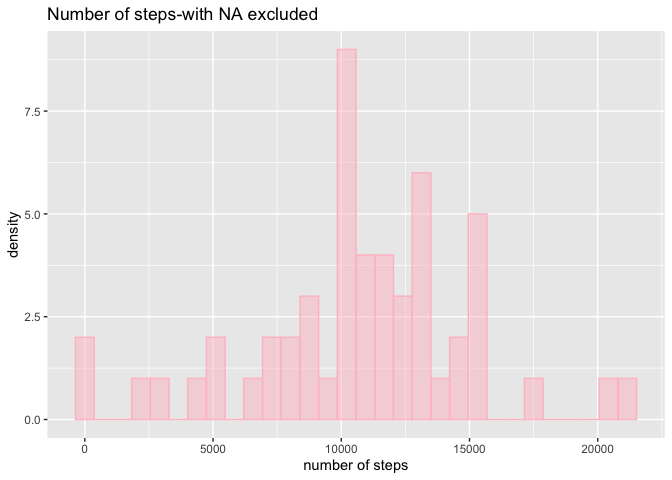
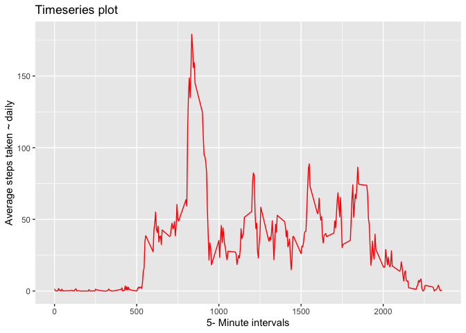
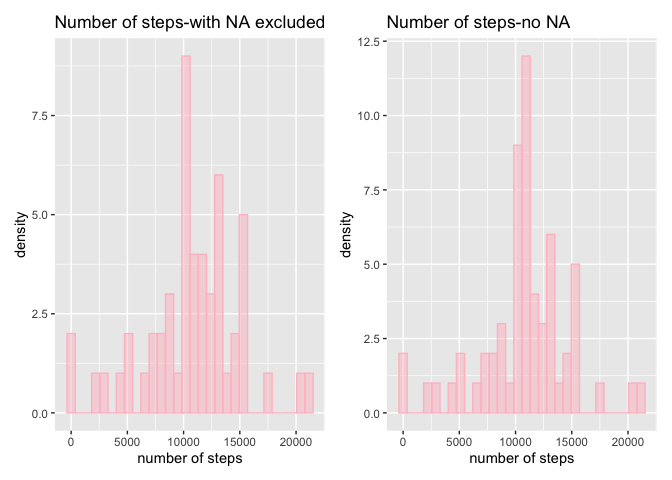
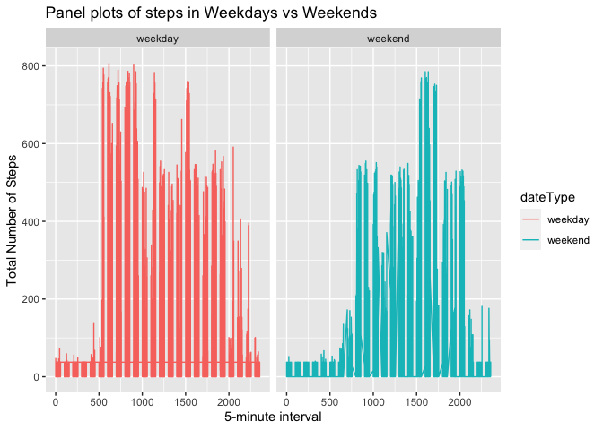

This assignment makes use of data from a personal activity monitoring device. This device collects data at 5 minute intervals through out the day. The data consists of two months of data from an anonymous individual collected during the months of October and November, 2012 and include the number of steps taken in 5 minute intervals each day.

The data for this assignment can be downloaded from the course web site:

The variables included in this dataset are three:

1. **steps**: Number of steps taking in a 5-minute interval (missing values are coded as \color{red}{\verb|NA|}NA)

2. **date**: The date on which the measurement was taken in YYYY-MM-DD format

3. **interval**: Identifier for the 5-minute interval in which measurement was taken

The dataset is stored in a comma-separated-value (CSV) file and there are a total of 17,568 observations in this dataset.


```r
library(readr)
library(ggplot2)
library(data.table)
library(dplyr)
```

```
## 
## Attaching package: 'dplyr'
```

```
## The following objects are masked from 'package:data.table':
## 
##     between, first, last
```

```
## The following objects are masked from 'package:stats':
## 
##     filter, lag
```

```
## The following objects are masked from 'package:base':
## 
##     intersect, setdiff, setequal, union
```

```r
library(patchwork)
#library(plyr)
```


Set the working directory to a folder that contains the data


```r
setwd("~/Documents/GitHub/RepData_PeerAssessment1")
```


## Loading and preprocessing the data


```r
data <- fread("curl https://d396qusza40orc.cloudfront.net/repdata%2Fdata%2Factivity.zip | funzip")
```

## What is mean total number of steps taken per day?

The total number of steps taken per day is **570,608**  


```r
total_number_steps_per_day <- data[, .(steps_day= sum(steps)), by= date]
head(total_number_steps_per_day)
```

```
##          date steps_day
## 1: 2012-10-01        NA
## 2: 2012-10-02       126
## 3: 2012-10-03     11352
## 4: 2012-10-04     12116
## 5: 2012-10-05     13294
## 6: 2012-10-06     15420
```

Excluding missing data


```r
missing_excluded <-na.omit(total_number_steps_per_day$steps_day)
sum(missing_excluded)
```

```
## [1] 570608
```

### 2. Histogram of the total number of steps taken each day


```r
total_number_steps_per_day_NA <- data[, .(steps_day= sum(steps)), by= date]

a<-qplot(total_number_steps_per_day_NA$steps, geom="histogram", main='Number of steps-with NA excluded',
      fill=I('pink'), col=I('pink'), alpha=I(0.5))  + xlab('number of steps') + ylab('density')
a
```

```
## `stat_bin()` using `bins = 30`. Pick better value with `binwidth`.
```

```
## Warning: Removed 8 rows containing non-finite values (stat_bin).
```

<!-- -->

```r
ggsave(a, file = 'fig.1_histogram_of_total_number_of_steps_day.png')
```

```
## Saving 7 x 5 in image
## `stat_bin()` using `bins = 30`. Pick better value with `binwidth`.
```

```
## Warning: Removed 8 rows containing non-finite values (stat_bin).
```

### 3. Mean and median number of   each day 

The mean and median steps taken per day is **10766.19** and **10765** steps respectively.

#### Mean


```r
mean(missing_excluded)
```

```
## [1] 10766.19
```

#### Median


```r
median(missing_excluded)
```

```
## [1] 10765
```


## What is the average daily activity pattern?


Here I am calculating mean steps by 5-minute intervals


```r
time_series <-data %>%
  replace(is.na(.), 0) %>%  # replace NAs with 0 for computation
  group_by(interval) %>%
  summarise(steps = mean(steps))
head(time_series)
```

```
## # A tibble: 6 x 2
##   interval  steps
##      <int>  <dbl>
## 1        0 1.49  
## 2        5 0.295 
## 3       10 0.115 
## 4       15 0.131 
## 5       20 0.0656
## 6       25 1.82
```

**1. Make a time series plot (i.e. \color{red}{\verb|type = "l"|}type = "l") of the 5-minute interval (x-axis) and the average number of steps taken, averaged across all days (y-axis)**


```r
ggplot(time_series, aes(interval, steps)) + geom_line(col='red') +xlab('5- Minute intervals') + 
ylab('Average steps taken ~ daily') +ggtitle("Timeseries plot")
```

<!-- -->

```r
ggsave('fig.2_time_series_plot_of_5_munte_interval.png')
```

```
## Saving 7 x 5 in image
```


**2. Which 5-minute interval, on average across all the days in the dataset, contains the maximum number of steps?**

The  5-minute interval that correspons with the maxmum average daily steps is **835**


```r
interval_at_max_steps <- time_series$interval[which.max(time_series$steps)]
interval_at_max_steps
```

```
## [1] 835
```


## Imputing missing values

Note that there are a number of days/intervals where there are missing values (coded as \color{red}{\verb|NA|}NA). The presence of missing days may introduce bias into some calculations or summaries of the data.

**1. Calculate and report the total number of missing values in the dataset (i.e. the total number of rows with \color{red}{\verb|NA|}NAs)**

The steps variable in the dataset has **2304** missing values


```r
sum(is.na(data$steps)) 
```

```
## [1] 2304
```
**2.Devise a strategy for filling in all of the missing values in the dataset. The strategy does not need to be sophisticated. For example, you could use the mean/median for that day, or the mean for that 5-minute interval, etc.**

 So I'm imputing using a mean for the whole variable. The replica of orginal data is dat here. 

Imputation- the mean over the entire variable is used to impute missing values


```r
dat <- data
# A <- dat %>% 
#        group_by(date) %>% 
#        mutate(steps = ifelse(is.na(steps), 
#                               mean(steps, na.rm=TRUE), steps))
# A

# uses mean from all dates where values are recorded
dat$steps[is.na(dat$steps)] <- mean(dat$steps, na.rm=TRUE)
```
**3.Create a new dataset that is equal to the original dataset but with the missing data filled in.**


```r
# uses mean from all dates where values are recorded
dat$steps[is.na(dat$steps)] <- mean(dat$steps, na.rm=TRUE)
dat
```

```
##          steps       date interval
##     1: 37.3826 2012-10-01        0
##     2: 37.3826 2012-10-01        5
##     3: 37.3826 2012-10-01       10
##     4: 37.3826 2012-10-01       15
##     5: 37.3826 2012-10-01       20
##    ---                            
## 17564: 37.3826 2012-11-30     2335
## 17565: 37.3826 2012-11-30     2340
## 17566: 37.3826 2012-11-30     2345
## 17567: 37.3826 2012-11-30     2350
## 17568: 37.3826 2012-11-30     2355
```
**4. Make a histogram of the total number of steps taken each day and Calculate and report the mean and median total number of steps taken per day. Do these values differ from the estimates from the first part of the assignment? What is the impact of imputing missing data on the estimates of the total daily number of steps?**

The result is not extremely different, the mean and median are pretty much closer


```r
total_number_steps_per_day_noNA <- dat[, .(steps_day= sum(steps)), by= date]

b<-qplot(total_number_steps_per_day_noNA$steps, geom="histogram", main='Number of steps-no NA',
      fill=I('pink'), col=I('pink'), alpha=I(0.5))  + xlab('number of steps') + ylab('density')
a+b
```

```
## `stat_bin()` using `bins = 30`. Pick better value with `binwidth`.
```

```
## Warning: Removed 8 rows containing non-finite values (stat_bin).
```

```
## `stat_bin()` using `bins = 30`. Pick better value with `binwidth`.
```

<!-- -->

```r
ggsave(b, file = 'fig.3_histogram_of_total_number_of_steps_day_updated.png')
```

```
## Saving 7 x 5 in image
## `stat_bin()` using `bins = 30`. Pick better value with `binwidth`.
```

#### Mean


```r
total_number_steps_per_day <- dat[, .(steps_day= sum(steps)), by= date]

mean(total_number_steps_per_day$steps)
```

```
## [1] 10766.19
```

#### Median


```r
median(total_number_steps_per_day$steps)
```

```
## [1] 10766.19
```

## Are there differences in activity patterns between weekdays and weekends?

For this part the \color{red}{\verb|weekdays()|}weekdays() function may be of some help here. Use the dataset with the filled-in missing values for this part.

**1. Create a new factor variable in the dataset with two levels – “weekday” and “weekend” indicating whether a given date is a weekday or weekend day.**


```r
library(lubridate)
```

```
## 
## Attaching package: 'lubridate'
```

```
## The following objects are masked from 'package:data.table':
## 
##     hour, isoweek, mday, minute, month, quarter, second, wday,
##     week, yday, year
```

```
## The following object is masked from 'package:base':
## 
##     date
```

```r
dat$date <- as.Date(dat$date)
dat$dateType <- ifelse(weekdays(dat$date) %in% c("Saturday", "Sunday"), "weekend", "weekday")

head(dat)
```

```
##      steps       date interval dateType
## 1: 37.3826 2012-10-01        0  weekday
## 2: 37.3826 2012-10-01        5  weekday
## 3: 37.3826 2012-10-01       10  weekday
## 4: 37.3826 2012-10-01       15  weekday
## 5: 37.3826 2012-10-01       20  weekday
## 6: 37.3826 2012-10-01       25  weekday
```


**2. Make a panel plot containing a time series plot (i.e. \color{red}{\verb|type = "l"|}type = "l") of the 5-minute interval (x-axis) and the average number of steps taken, averaged across all weekday days or weekend days (y-axis). See the README file in the GitHub repository to see an example of what this plot should look like using simulated data.**


```r
ggplot(dat, aes(x =interval , y=steps, color=dateType)) +
       geom_line() + labs(title = "Panel plots of steps in Weekdays vs Weekends", x = "5-minute interval", y = "Total Number of Steps") +facet_wrap(~ dateType)
```

<!-- -->

```r
ggsave('fig.4_panel_plots.png')
```

```
## Saving 7 x 5 in image
```
